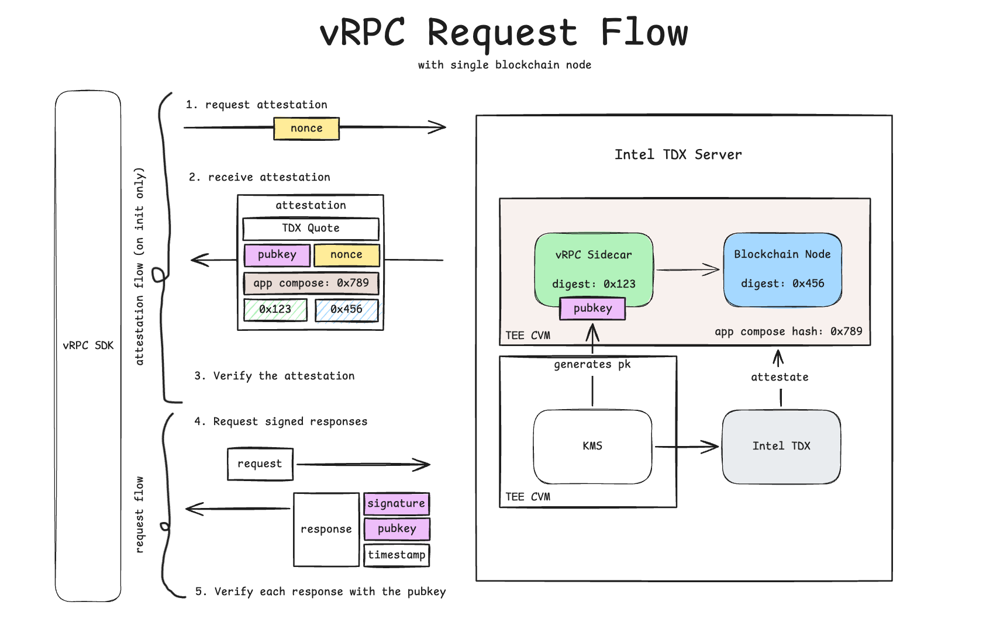
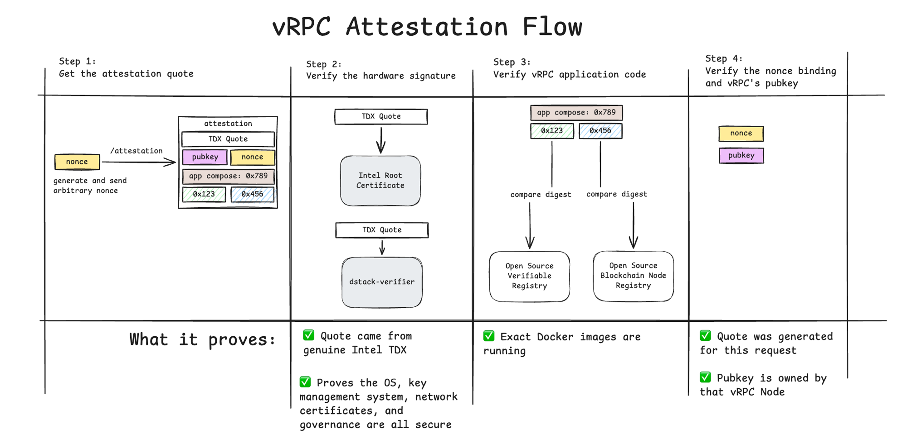
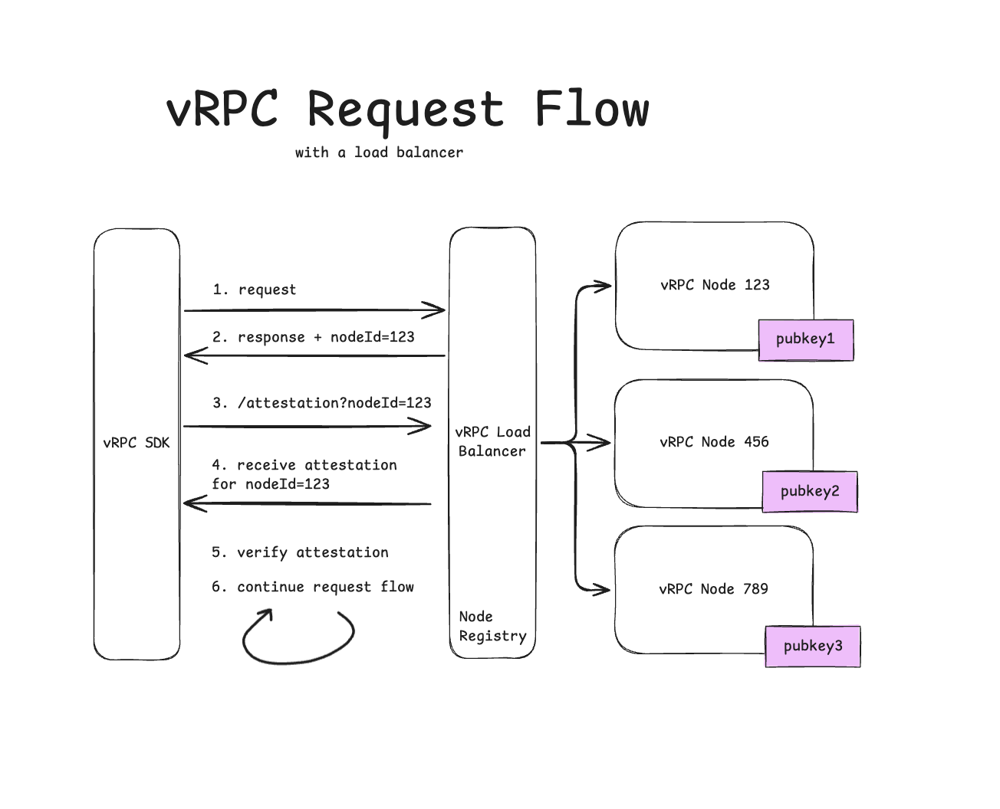

# Verifiable RPC (vRPC)

**vRPC lets you verify, on your own side, that every RPC response came from approved, unmodified node software running in a hardware enclave - not just trust the operator's word.**

*How it works, what it proves, and how to run it.*

> [!TIP]
> **Reading this as an AI agent?** This repo ships a skill at `.claude/skills/explain-vrpc/`. Point your agent (Claude Code, opencode, anything) at the repo - it can explain vRPC, walk the attestation, and run the verification chain for you, grounded in the code with cited sources.

---

## What it is

When you call an RPC endpoint, you trust the operator to return real chain data and to run the software they claim. vRPC removes that trust. Every response comes back signed inside an Intel TDX hardware enclave by a key that never leaves the enclave, and your client checks that signature before the data reaches your code.

Two ways to plug it in:

- **SDK drop-in** - swap one line in your ethers or viem client. Every existing call keeps working, now verified.
- **Thin local proxy** - a small vRPC verifying proxy that does the checks and re-exposes a plain RPC endpoint, for stacks that don't use the TS SDK (Go, Rust, anything). Point your existing RPC client at it.

The attack this closes: an RPC response altered in memory, or by a compromised or mis-routed proxy hop. A node that does not hold the enclave's signing key cannot produce a valid signature, so a falsified response fails verification at your client.

**What a verified response proves today:**

- It was signed by the node's enclave-bound key, not a proxy or a man-in-the-middle.
- The response bytes were not altered after signing.
- It is fresh - the timestamp sits inside a replay window (default 60s).
- It is bound to the chain you asked for.

Verification is **fail-closed**: if any check fails, the call throws and you get nothing back. The client never hands you unverified data.

---

## How it works



A vRPC node runs inside an Intel TDX confidential VM (a "CVM"), built on [Phala dstack](https://docs.phala.com/dstack/). Two things run in that enclave:

- the **blockchain node** (e.g. Arbitrum Nitro), and
- the **vRPC sidecar**, which sits in front of the node, proxies RPC traffic, and signs every response.

The signing key is an Ed25519 key the enclave's KMS generates *inside* the CVM. It exists only there. Its public half is bound into the TDX attestation quote, so anyone can confirm the key signing your responses really belongs to that enclave.

Each response carries three headers - `vRPC-Pubkey`, `vRPC-Timestamp`, `vRPC-Signature`. The signature covers a 104-byte pre-image of four segments:

```
sha256(utf8(chain_id)) (32B) ‖ sha256(request_body) (32B) ‖ sha256(response_body) (32B) ‖ timestamp_ms (8B LE)
```

The client rebuilds that pre-image from the bytes it sent and received, then verifies the signature. That check runs locally on data you already have, so it adds **no network latency to a call**. The attestation itself is fetched once per node and cached for a configurable TTL (default one hour), so it stays off the hot path.

---

## What each check proves

The full attestation is four steps. Each proves one property and closes one class of attack.



| Step | What it checks | What it proves | Closes |
|---|---|---|---|
| **1. Get the quote** | Send a fresh nonce; receive the TDX quote, pubkey, app-compose, and image digests | You hold a hardware-signed measurement of what is running | - |
| **2. Verify the hardware signature** | The quote chains to Intel's root certificate (via dstack-verifier) | The quote came from genuine Intel TDX, and the OS, key management, network certs, and governance are the attested ones | Fake or emulated TEE, firmware or OS tampering |
| **3. Verify the application code** | Compare the app-compose hash and image digests against the open-source signed release | The exact approved Docker images are running, nothing swapped | Code substitution, image or tag mutation |
| **4. Verify nonce + pubkey binding** | The quote's `report_data` contains your nonce and the signing pubkey | This quote was made for your request, and the signing key belongs to this node | Replay of an old quote, swapped or wrong-node key |

---

## What the SDK verifies

The SDK is in **alpha**. The design is the full four-step chain above; here is what runs on every call today and what is still landing. Everything below is fail-closed - if a check fails, the call throws.

- ✅ **Ed25519 response signature** over the 104-byte pre-image
- ✅ **Freshness + chain binding** - replay window (default 60s) and the chain you pinned
- ✅ **Pubkey correlation** - the attestation's pubkey equals the response signer
- ✅ **Nonce + pubkey hardware binding** (Step 4) - the quote's `report_data` carries your nonce and the signing key, checked first and unconditionally
- ✅ **Hardware-signature verification** (Step 2) - **mandatory**. The quote is verified by Phala's cloud verifier by default (overridable / self-hostable); with no verifier configured the call fails closed.
- ⚠️ **Compose-hash check** (part of Step 3) - `sha256(app_compose) == compose_hash` is enforced when the node reports both, but today it is **self-consistency only**: both values come from the same node, so it catches drift, not a malicious node. A real anchor needs an independent compose source plus RTMR3 replay.
- 🚧 **Still landing:** local DCAP / Intel-root quote verification (so you don't have to trust the cloud verifier), RTMR3 event-log replay, and an independent compose/image **registry** for Step 3. You can run Phala's [dstack-verifier](https://github.com/Dstack-TEE/dstack/tree/master/verifier) yourself for the full local chain today.

**Out of scope for now:** WebSocket subscriptions (`eth_subscribe` - the signed path is HTTP-only), ENS off-chain reads (CCIP, avatar, IPFS), historical snapshot integrity.

---

## Quickstart - run the SDK

Repos:

- **SDK** - https://github.com/w3tech/verifiable-rpc-sdk (TypeScript, Apache-2.0) - you are here
- **Sidecar** - https://github.com/w3tech/verifiable-rpc-sidecar (Rust, AGPL-3.0)

### The one-line swap

```ts
// ethers v6 - was:  new ethers.JsonRpcProvider(url)
import { VrpcProvider } from "@w3tech.io/vrpc-ethers";
const provider = new VrpcProvider(url, chainId);

// viem - was:  http(url)
import { vrpcHttp } from "@w3tech.io/vrpc-viem";
const client = createPublicClient({ chain, transport: vrpcHttp(url) });
```

You pass **one** plain URL (e.g. `https://rpc.ankr.com/arbitrum`). The SDK derives the `_vrpc` RPC route and the `/attestation` route itself - there is no second base URL to configure. `chainId` is optional (the SDK can derive it from a *signed* `eth_chainId`) but passing it is recommended: it pins your expected chain and skips a round-trip.

Everything downstream - `getBalance`, `eth_call`, `getLogs`, contract reads, `estimateGas` - works exactly as before, now verified.

### Get it running

```bash
git clone https://github.com/w3tech/verifiable-rpc-sdk
cd verifiable-rpc-sdk
pnpm install
```

The repo ships runnable examples, wired to `pnpm` scripts:

```bash
pnpm example:01-ethers-client          # ethers drop-in
pnpm example:02-viem-client            # viem transport
pnpm example:03-vrpc-core-walkthrough  # the core primitives, step by step
```

The packages are published to npm under the `@w3tech.io` scope (`pnpm add @w3tech.io/vrpc-ethers ethers` or `pnpm add @w3tech.io/vrpc-viem viem`). See the per-adapter [package READMEs](../packages) and [MIGRATION.md](../MIGRATION.md) for pointing the examples at a live vRPC endpoint and key.

### Inspect mode

Beyond the automatic per-call verification, the SDK exposes the proof: `fetchAttestation()` returns the raw quote, signing pubkey, and compose hash, and `verifyAttestationCorrelation()` checks the attestation pubkey against a response signer — the same correlation `TrustedVerifier` runs lazily on every new pubkey. (Behind a load balancer the attestation fetch needs the node id from a prior response - the verified path supplies it automatically.)

---

## Threat model / FAQ

**Where do I run verification?** On your client, outside the CVM. A check that runs inside the enclave it is meant to be checking proves nothing.

**What stops a replay?** Your client sends a fresh random 32-byte nonce on every attestation fetch, and that nonce is bound into the quote's `report_data` (Step 4). A captured old quote will not match a new nonce.

**What stops a swapped key or wrong node?** The attestation pubkey must equal the response signer (correlation), and `report_data` binds that pubkey into the hardware quote. A response signed by any other key fails.

**Could a malicious image be published?** The defense is openness, not a promise. The blockchain node images and the sidecar are open source and community-verified - anyone can read the code. Releases are signed, and a node only runs images that have been public for at least ~3 days, so there is a window for the community to catch a bad release before it goes live. You compare the hash the node attests to against that public signed release; an automated registry that tracks releases is in progress.

**Why should I trust the operator?** You don't. Both repos are open source, the sidecar's container images are Cosign-signed, and the proof travels with each response. The operator becomes untrusted infrastructure - you verify the math.

**Attack-defense summary:**

| Attack | Defended by | Status |
|---|---|---|
| Response altered in transit or by a proxy | Ed25519 signature over request + response bytes | ✅ Enforced |
| Replay of an old response or quote | Fresh nonce + timestamp window | ✅ Enforced |
| Swapped or wrong-node signing key | Pubkey correlation + `report_data` binding | ✅ Enforced |
| Wrong chain | `chain_id` bound into the signed pre-image | ✅ Enforced |
| Code or image substitution | compose-hash check (self-consistency) + compare to the open-source signed release | ⚠️ self-consistency + manual compare today · independent registry 🚧 |
| Fake or emulated TEE, firmware/OS tamper | hardware-signature verification (Phala cloud verifier, mandatory) | ✅ today · local DCAP 🚧 |

---

## Try it

1. Clone the SDK and run an example against a vRPC endpoint - one line swaps your provider, and every call comes back verified.
2. Want the full chain of trust now, not just the signature? Run [dstack-verifier](https://github.com/Dstack-TEE/dstack/tree/master/verifier) against the sidecar's quote.
3. Want it hands-off? Point your agent at the repo and let it walk the attestation for you.

Swap one line, make a verified call, and check the proof yourself.

---

## Appendix - with a load balancer

In production you reach many nodes through a load balancer. Each response carries a `vRPC-NodeId`; the SDK uses it to fetch that specific node's attestation, verifies it, then continues. The load balancer holds no signing keys and runs no verification logic. It only routes.


